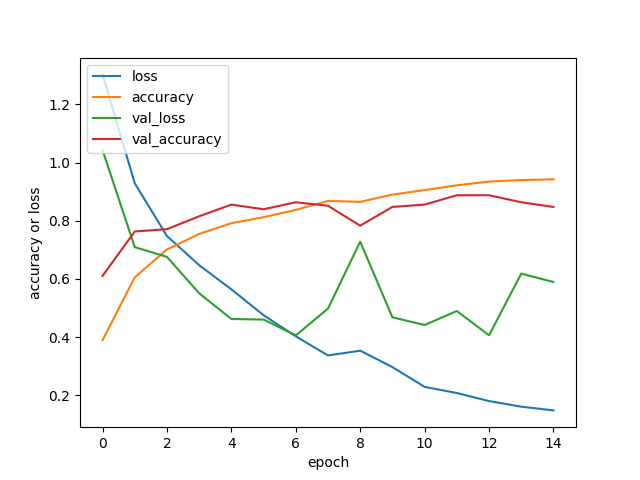

Sylvan LE DEUNFF

# Projet Traitement et Analyse d’Images
# IMR3 – 2019-2020
# Classification d’images


Aujourd'hui la croissance du numérique, et le développement des services Cloud amènent une explosion du nombre de documents multimédias à stocker. En particulier les images qui sont omniprésentes sur les réseaux sociaux comme Facebook, Instagram ou Snapchat. Pour pouvoir rechercher ces images ou en extraire de l'information, on peut utiliser des métadonnées, mais celles-ci sont bien souvent incomplètes ou erronnées. Il devient donc nécessaire de pouvoir classifier ces images non-plus selon leur métadonnées, mais en se basant sur leur contenu.

Pour ce TP, nous nous intéressons à une problématique de classification d'images. L'objectif ici est donc d'être en mesure d'attribuer une étiquette (classe) à une image à partir de son contenu. Pour cela nous comparerons 2 approches :

- la classification basée sur des vecteurs de distances entre les primitives de l'image.
- la classification par un réseau de neurones convolutif.

## Utilisation

### Installation des pré-requis

* python3
* cloner le projet git / ou le telecharger
* puis à la racine du projet :

```bash
# créer un environnement virtuel (évite les conflits avec des libs existantes)
virtualenv venv -p python3

# activer l'environnement (linux)
source env/bin/activate
# OU sous windows: 
\venv\Scripts\activate.bat

# installer les dépendances du projet
pip install -r requirements
```

## Préparation des données

Ici les images étudiées proviennent de la base de données Corel. C'est un ensemble d'image provenant d'une galerie photo de même nom, qui ont été labellisés et rangées dans des répertoires portant les noms de ces étiquettes.

*Exemple de structure de la BDD*
```
coreldb
├── ...
├── pet_cat
└── pet_dog
```

### Répartition des données en 3 sous-ensembles

Avant de nous attaquer à un problème de classification d'images, il convient pour chaque feature de répartir les données en 3 sous-ensembles. A savoir :

* **apprentissage**: ce sont les données qui seront utilisées pour entraîner notre modèle.

* **validation**: les données de cet ensemble ne sont pas utilisées lors de l'apprentissage. elles permettront d'ajuster les hyper-paramètres du modèle.

* **test**: ces données servent à évaluer la précision d'un modèle *après entrainement*. Il est essentiel qu'elles n'aient pas servi pendant les phases d'apprentissage ou de test. Dans le cas contraire, on risque de sur-entrainer notre modèle qui ne fera plus à proprement parler des "prédictions" mais de la mémorisation.

Nous commencons donc par ajouter une méthode statique à notre classe `Database.create`, qui crée une nouvelle base de donénes ou les images labellisées sont réparties en 3 sous-ensembles (test, validation, train). 
- Elle prend en paramètre le nom du répertoire où sont localisées les images labellisées (paramètre `from_folder`).
- La répartition des images dans les ensembles train, validation et tests peut être controlée en passant un 3-uplet au paramètre `ratio`.
- Par défaut, 3 fichiers CSV sont créés, qui contiennent l'association `<chemin vers image>/<classe de l'image>`.
- Par défaut, les classes à extraire de la base source sont choisies aléatoires. Il est possible d'en spécifier la liste via le paramètre `classes`.

```python
class Database:
    """
    Helper to create and interract with database.
    """

    @classmethod
    def _generate_labels_file(cls, database_path, subfolder):
        """
        Create a CSV file wich associate image path and its class.

        Parameters:
            - subfolder: string in (train, test, validation)
        """
        database_subfolder = os.path.join(database_path, subfolder)
        labels_file = os.path.join(database_path, subfolder + '_labels.csv')

        if os.path.exists(labels_file):
            return
        
        with open(labels_file, 'w', encoding='UTF-8') as f:
            f.write("img,cls")
            for root, _, files in os.walk(database_subfolder, topdown=False):
                classe = os.path.split(root)[-1]

                for name in files:
                    if name[:-4] in ('.jpg', '.png'):
                        continue
                
                    img = os.path.join(root, name)
                    f.write("\n{},{}".format(img, classe))
    
    @classmethod
    def random_classes(cls, from_folder):
        """
        Return a set of 2-8 classes randomly picked in <from_folder>.
        """
        n = randint(2, 8)
        # recupere la liste de toutes les classes dans un ordre aleatoire
        all_classes = sorted(os.listdir(from_folder), key=lambda x: random())
        # renvoie les n premiers resultats
        return all_classes[:n]
        

    @classmethod
    def create(cls, database_name, from_folder, classes=None, ratios=(0.7, 0.15, 0.15), csv_labels=True):
        """
        Create a new database with train, validation and test subfolders.

        Parameters:
            - database_name: name of the folder to be created.
            - from_folder: another folder containing images labelized in subfolders.
            - ratios: proportion of respectively train, validation and test subsets.
            - classes: list of classes that will be extracted from original folder
                if not specified, a set of 2-8 classes will be randomly picked.
        """
        assert sum(ratios) == 1, "Sum of ratios must be equal to 1!"

        # supprime une base de données de même nom qui pourrait exister
        shutil.rmtree(database_name, ignore_errors=True)

        # si aucune classe n'est passée en paramètre, en choisi aléatoirement
        if not classes:
            classes = cls.random_classes(from_folder)
        
        for classe in classes:
            origin_class_path = os.path.join(from_folder, classe)
            # recupere la liste des images de cette classe dans un ordre aleatoire
            class_images = sorted(os.listdir(origin_class_path), key=lambda x: random())
            # 
            n = len(class_images)
            slices = (0, int(n*ratios[0]), int(n*(ratios[0]+ratios[1])), n)

            subfolders = ('train', 'validation', 'test')
            for k in range(3):
                # crée au fur et a mesure l'arborescence de la nouvelle base de données
                dest_folder = os.path.join(database_name, subfolders[k], classe)
                os.makedirs(dest_folder)
                # copie un sous ensemble des images dans le repertoire
                for image in class_images[slices[k]: slices[k+1]]:
                    shutil.copy(
                        os.path.join(origin_class_path, image),
                        os.path.join(dest_folder, image)
                    )

        if csv_labels:
            cls._generate_labels_file(database_name, 'train')
            cls._generate_labels_file(database_name, 'validation')
            cls._generate_labels_file(database_name, 'test')

```

Exemple d'utilisation

On crée une base avec 2 classes (chien / chat)

```python
Database.create(
    'database', 
    from_folder='coreldb', 
    classes=['pet_cat', 'pet_dog'],
    labels=True
)
```

Après exécution de ce script la base de travail générée est la suivante.

```
database/
├── test_labels.csv
├── train_labels.csv
├── validation_labels.csv
|
├── test
│   ├── pet_cat
│   └── pet_dog
├── train
│   ├── pet_cat
│   └── pet_dog
└── validation
     ├── pet_cat
     └── pet_dog
```

## Classification d'images basée sur leurs attributs (CBIR)

Nous allons à présent chercher à classifier des images en fonctions de leurs attributs. Pour cela nous nous appuyons sur la librairie suivante :

https://github.com/pochih/CBIR/

## Classification par un CNN

Un réseau de neurones convolutif (CNN) est un algorithme d'apprentissage profond qui peut prendre une image d'entrée, attribuer une importance à divers aspects/objets de l'image et être capable de les différencier les uns des autres. Le prétraitement requis dans un CNN est beaucoup moins important que dans d'autres algorithmes de classification. En effet les méthodes basées sur l'analyse des primitives comme le CBIR, nécessitent de concevoir les filtres à la main, ce qui demande des connaissances d'expertise. A l'inverse, les CNN ont la capacité d'apprendre "naturellement" ces filtres/caractéristiques.

L'architecture d'un CNN est analogue à celle du schéma de connectivité des neurones dans le cerveau humain et s'inspire de l'organisation du cortex visuel. Les neurones individuels répondent aux stimuli que dans une région restreinte du champ visuel appelée le champ de réception. Un ensemble de ces champs se chevauchent pour couvrir la totalité de la zone visuelle.


### Structure du NN utilisé

### Entrainement du modèle

#### Paramètres de l'apprentissage

- Le paramètre **batch_size** est un hyperparamètre qui définit le nombre d'échantillons à traiter avant de mettre à jour les paramètres du modèle interne. Après traitement d'un lot (batch), les prédictions sont comparées aux variables de sortie attendues et une erreur est calculée. À partir de cette erreur, l'algorithme de mise à jour est utilisé pour améliorer le modèle, par exemple en se déplaçant vers le bas le long du gradient d'erreur. Son maximum est le nombre de tous les échantillons, ce qui rend la descente de gradient précise, la perte diminuera vers le minimum si le taux d'apprentissage est assez faible, mais les itérations sont plus lentes. Son minimum est de 1, ce qui entraîne une descente stochastique du gradient : Rapide mais la direction du pas du gradient n'est basée que sur un seul exemple, le loss peut donc ne pas converger.

- Le nombre d'**epochs** est un hyperparamètre qui définit le nombre de fois que l'algorithme d'apprentissage va travailler sur l'ensemble des données d'entrainement. Dans un epoch chaque échantillon de l'ensemble de données d'apprentissage a eu l'occasion de mettre à jour les paramètres internes du modèle. Un epoch est composée d'un ou plusieurs batch(s). Il est courant de créer des tracés linéaires de l'accuracy et du loss en fonction du nombre d'epochs. Ces tracés (courbes d'apprentissage) peuvent aider à diagnostiquer si le modèle a sur-appris, sous-appris, ou s'il est convenablement adapté à l'ensemble de données d'apprentissage.


### Tests du modèle et évaluation des résultats



